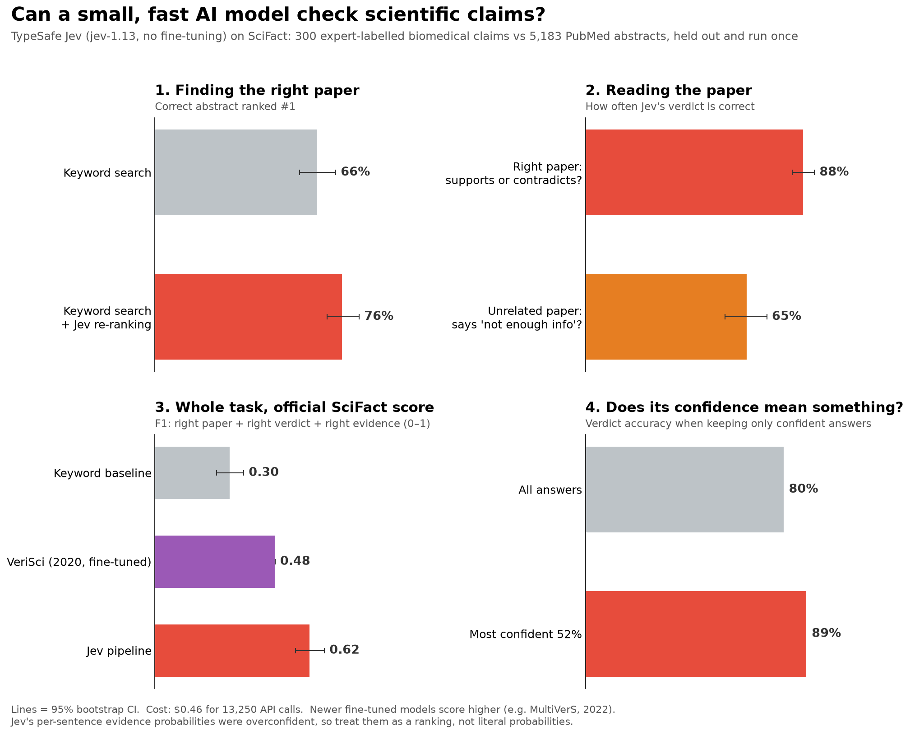
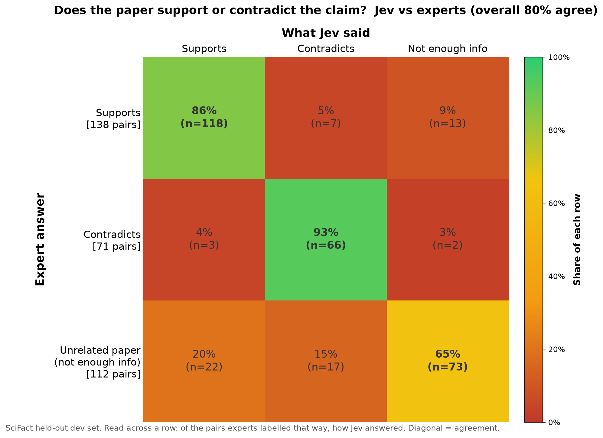
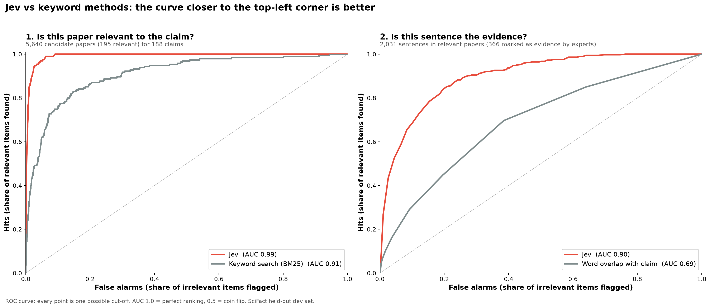

# Evaluating TypeSafe Jev on SciFact scientific claim verification

An independent, pre-registered evaluation of [TypeSafe](https://docs.typesafe.ai)'s Jev model (`jev-1.13.0`)
on [SciFact](https://github.com/allenai/scifact): 300 expert-labelled biomedical claims checked against 5,183 PubMed abstracts.
The held-out dev split was run once, after question wording and thresholds were frozen on 100 training claims.



<p float="left">
  
  
</p>

## Results (held-out dev, 95% bootstrap CIs)

| | Result |
|---|---|
| Correct abstract ranked #1: BM25 → BM25 + Jev re-rank | 0.656 → **0.756** (paired gain +0.100 [0.048, 0.157]) |
| Verdict accuracy given the right abstract (supports vs contradicts) | **0.880** [0.835, 0.924] |
| "Not enough info" accuracy on an unrelated top-ranked abstract | 0.652 [0.563, 0.732] |
| Official SciFact abstract Label+Rationale F1 | **0.625** [0.567, 0.684] (keyword baseline 0.303; VeriSci 2020, dev: 0.485) |
| Official sentence Selection+Label F1 | 0.447 [0.398, 0.495] (VeriSci 2020, dev: 0.426) |
| Total API cost | $0.46 for 13,250 calls |

**Caveats:**
- Newer fine-tuned systems (e.g. MultiVerS, 2022) score higher.
- Jev's per-sentence evidence probabilities are overconfident (ECE 0.38), so use them for ranking rather than as calibrated probabilities.
- The VeriSci comparison is descriptive, not a paired test.

The full methods, results and limitations are in [`docs/scifact_jev_evaluation_methods.md`](docs/scifact_jev_evaluation_methods.md).
The pre-registered design is in [`docs/superpowers/specs/`](docs/superpowers/specs/).

## Pipeline

| Stage | Script | What it does |
|---|---|---|
| 01 | `scripts/01_bm25_retrieve.py` | BM25 retrieves the top 30 abstracts per claim |
| 02 | `scripts/02_jev_rerank.py` | A Jev **Score** question rates how directly each abstract addresses the claim |
| 03 | `scripts/03_jev_verify.py` | For the top 3: a Jev **Choice** verdict, plus one **Noul** per sentence ("is this evidence?") |
| 04 | `scripts/04_assemble_predictions.py` | Applies the thresholds, which are tuned on train only |
| 05 | `scripts/05_evaluate.py` | Runs the official SciFact metrics (vendored), plus bootstrap CIs, calibration and figures |

Paid calls go through a cached runner with a hard spend cap (`scripts/lib/budget.py`, `scripts/lib/jev_client.py`).

## Reproduce

```bash
uv sync
uv run python scripts/fetch_scifact.py          # downloads SciFact and verifies its checksum
uv run python scripts/01_bm25_retrieve.py --split dev
# 02 and 03 need TYPESAFE_API_KEY and cost about $0.35 for dev
uv run python scripts/02_jev_rerank.py --split dev
uv run python scripts/03_jev_verify.py --split dev
uv run python scripts/04_assemble_predictions.py --split dev
uv run python scripts/05_evaluate.py --split dev
uv run pytest -q
```

Jev's answers are committed (`data/processed/scifact/*/rerank.jsonl`, `verify.jsonl`), so stages 04 and 05 reproduce every
table and figure without an API key.

## Data and licences

SciFact claims are licensed CC BY 4.0 and its abstracts ODC-By 1.0 (S2ORC). The raw data is downloaded by the fetch script
and not redistributed here. The official SciFact scoring code in `scripts/lib/scifact_official/` is Apache-2.0 (allenai/scifact).

This is an independent evaluation, with no affiliation to TypeSafe.
