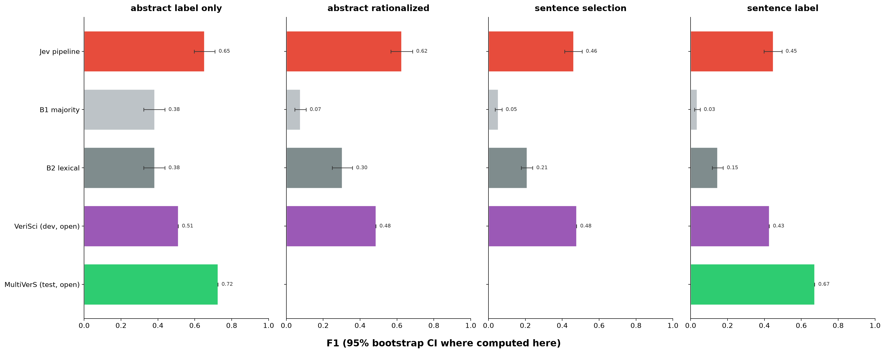
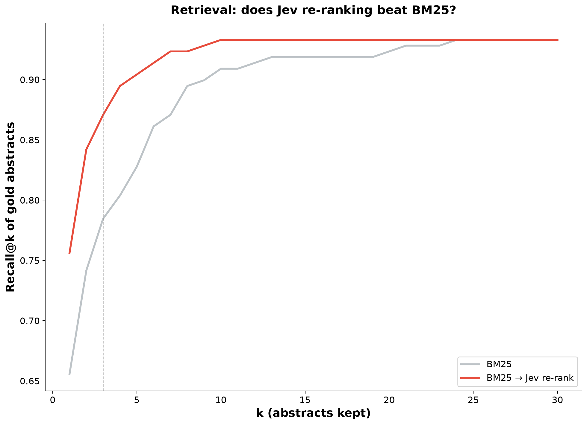
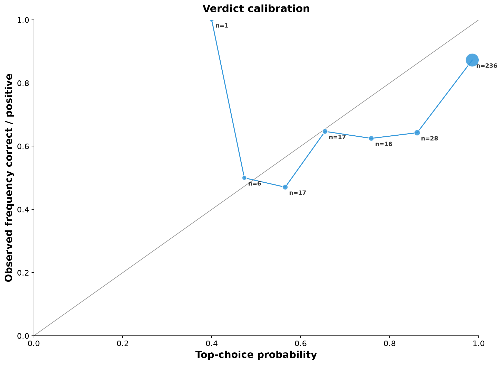
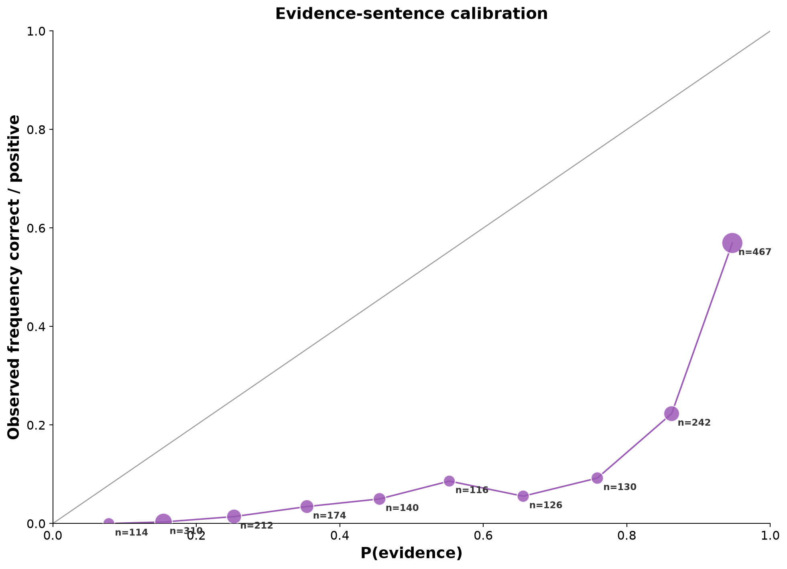
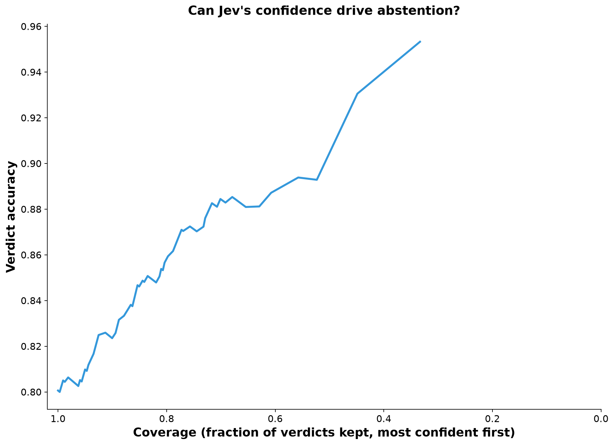

# Evaluating Jev on SciFact scientific claim verification: methods and results

## 1. Aim

To measure how well TypeSafe's Jev model handles a biomedical evidence task, using labels from independent
experts. The task has three parts:
1. Re-rank retrieved abstracts for a scientific claim.
2. Decide whether an abstract supports or contradicts the claim.
3. Select the evidence sentences.

Performance is compared with non-learned baselines and published SciFact systems, and the analysis checks
whether Jev's reported confidence tracks its accuracy.
The design is pre-registered in `docs/superpowers/specs/2026-09-29-scifact-jev-evaluation-design.md`.

## 2. Data

- **SciFact** (Wadden et al., 2020), official release `data.tar.gz`, SHA-256
  `11c621288d41ac144d29b13b0f8503b3820b7d6e8b1f6ff24dff335c196d76be`.
  Licences (repository LICENSE.md): claims CC BY 4.0; abstracts ODC-By 1.0 (S2ORC).
- **Corpus:** 5,183 PubMed abstracts, pre-split into sentences (median 8, max 367).
- **Development split:** a fixed random sample of 100 of the 809 train claims (`numpy.random.default_rng(20260929)`).
- **Held-out split:** all 300 dev claims (188 with evidence; 209 gold claim–abstract pairs).
  Test-set labels are hidden and were not used.
- **Join-key handling:** `doc_id` is an integer in the corpus but a string key in the claim evidence. All keys are cast to `int` at load time (tested).

## 3. Model and software

- **Model:** Jev `jev-1.13.0`, pinned by version ID rather than the `jev-latest` alias. TypeSafe Python SDK 0.7.2, Python 3.14.2.
- **Timing:** all API calls were made on 2026-09-29, between 21:04 and 21:22 UTC (`data/processed/scifact/spend_ledger.csv`).
- **Client settings:** 60 s timeout; `RetryPolicy(max_retries=6, backoff ≤ 30 s)`; at most 16 concurrent requests.
- **Caching:** every response is cached, keyed by the SHA-256 of (model, state, questions), so re-running a stage makes no API calls.
- **Official scoring:** code vendored unmodified from `allenai/scifact` @ `68b98a56`, and verified against the worked example in its `doc/evaluation.md` (abstract F1 = 1/2, sentence F1 = 2/9).

## 4. Pipeline

1. **Retrieval (no model).**
   - BM25 Okapi (`rank_bm25`, k1 = 1.5, b = 0.75) over title + abstract.
   - Tokens are lower-cased alphanumeric runs, with scikit-learn's English stopwords removed.
   - The top 30 abstracts are kept per claim.
2. **Re-ranking (Jev Score).**
   - One request per (claim, candidate). State: `{"claim", "abstract": {"title", "text"}}`.
   - Candidates are sorted by the Score expectation, with ties broken by BM25 rank.
3. **Verification (Jev Choice + Nouls).**
   - Judged pairs: the top 3 re-ranked abstracts for every claim, plus any gold abstract outside the top 3 (the "oracle" pairs, used only in §7.3).
   - State: `{"claim", "abstract": {"title", "sentences": {"s0": …}}}`.
   - One request asks the verdict Choice and one evidence Noul per sentence, all in parallel.
   - Abstracts with more than 40 sentences have their Nouls split across requests of at most 40 over the same state.
4. **Assembly (code).**
   - An abstract is predicted only if its verdict is not `not_enough_info` and verdict confidence ≥ τ_v.
   - Its evidence sentences are those with P(evidence) ≥ τ_s, highest first. If none pass, the single highest is used.
   - Only the first three evidence sentences count towards abstract-level scores (official rule).
5. **Thresholds.** τ_v = 0.80 and τ_s = 0.90 were chosen on the train sample by grid search (step 0.05),
   maximising abstract Label+Rationale F1 (ties broken by sentence Selection+Label F1).

### 4.1 Questions (version v1, frozen at git tag `questions-frozen`)

**Re-rank Score**
- Instructions: *"How directly does the abstract in `abstract` address the scientific claim in `claim`?"*
- Levels:
  - 0: *The abstract is about a different topic from the claim.*
  - 1: *The abstract is on the same general topic, but it does not study what the claim asserts.*
  - 2: *The abstract studies what the claim is about, but its reported findings neither confirm nor refute the claim.*
  - 3: *The abstract reports findings that directly confirm or refute the claim.*

**Verdict Choice**
- Instructions: *"Based only on `abstract`, does it support or contradict the scientific claim in `claim`?"*
- Options:
  - `supports`: *The abstract reports findings showing that the claim is true.*
  - `contradicts`: *The abstract reports findings showing that the claim is false, including an effect in the opposite direction to the claim or no effect where the claim asserts one.*
  - `not_enough_info`: *The abstract does not report a finding that shows whether the claim is true or false, including when it is on the same topic but studies something different.*

**Evidence Noul (one per sentence i)**
- *"Does sentence `abstract.sentences.s{i}` report a result or finding that, on its own or together with neighbouring sentences, helps show whether the claim in `claim` is true or false?"*

## 5. Question development

There was one version (v1). Its train results were:
- verdict accuracy on gold pairs: 81%;
- re-rank R@1: 0.586 → 0.690;
- abstract Label+Rationale F1: 0.530.

The pre-registered revision trigger (gold CONTRADICT answered `not_enough_info` in more than 30% of pairs) was not met:
2/14 = 14%. No rewording was made, and dev was run once with the frozen questions and thresholds. The one
interruption during the dev run was a transient API connection or timeout failure. It was resumed from cache;
the answers are those of a single run. See `docs/scifact_question_development_log.md`.

## 6. Metrics

- **Official SciFact metrics.**
  - Abstract-level Label-only and Label+Rationale.
  - Sentence-level Selection-only and Selection+Label.
  - Each reported as precision, recall and F1.
- **Uncertainty.** 95% percentile bootstrap CIs for every reported dev metric: 1,000 resamples of claims (seed 20260929),
  keeping all rows of a claim together. Official metric counts are summed within each resample. Jev − BM25 retrieval differences
  use a paired bootstrap.
- **Retrieval.** Micro recall@k over (claim, gold abstract) pairs; MRR of the first gold abstract per claim.
- **Verification in isolation.** Measured on (claim, gold abstract) pairs, plus NEI claims paired with their re-ranked top-1 abstract (gold label `not_enough_info`).
- **Calibration.** Expected calibration error (ECE), using 10 equal-width bins weighted by count:
  - For the verdict, the top-choice probability is compared with correctness. Choice *confidence* is a concentration measure, not a probability, so it is used only for the selective-prediction curve.
  - For evidence Nouls, P(yes) is compared with gold-evidence membership, over all sentences of gold abstracts.

## 7. Results (held-out dev, 300 claims)

### 7.1 Official metrics

| System | Abstract Label-only F1 | Abstract Label+Rationale F1 | Sentence Selection F1 | Sentence Selection+Label F1 |
|---|---|---|---|---|
| **Jev pipeline** | **0.652** [0.597, 0.709] | **0.625** [0.567, 0.684] | 0.461 [0.413, 0.508] | 0.447 [0.398, 0.495] |
| B2: BM25 top-1 + SUPPORT + lexical sentences | 0.381 [0.323, 0.437] | 0.303 [0.249, 0.358] | 0.209 [0.177, 0.239] | 0.145 [0.117, 0.176] |
| B1: BM25 top-1 + SUPPORT + first 3 sentences | 0.381 [0.323, 0.437] | 0.075 [0.045, 0.107] | 0.052 [0.035, 0.073] | 0.035 [0.021, 0.051] |
| VeriSci (published; dev, open retrieval) | 0.510 | 0.485 | 0.477 | 0.426 |
| MultiVerS (published; **test**, open; context only) | 0.725 | not reported | not reported | 0.672 |

Jev precision and recall: abstract Label+Rationale P = 0.589, R = 0.665; sentence Selection+Label P = 0.345, R = 0.634.

### 7.2 Retrieval

| Ranker | R@1 | R@3 | R@10 | R@30 | MRR |
|---|---|---|---|---|---|
| BM25 | 0.656 [0.583, 0.730] | 0.785 [0.718, 0.852] | 0.909 [0.858, 0.950] | 0.933 | 0.801 [0.752, 0.847] |
| BM25 → Jev re-rank | **0.756** [0.694, 0.824] | **0.871** [0.822, 0.919] | **0.933** [0.894, 0.967] | 0.933 | **0.884** [0.844, 0.922] |
| Paired difference (Jev − BM25) | **+0.100** [0.048, 0.157] | **+0.086** [0.040, 0.133] | +0.024 [0.005, 0.049] | 0 | **+0.083** [0.044, 0.126] |

95% CIs come from resampling claims. Differences are paired (both rankers are scored on the same resample).
R@30 is identical by construction: re-ranking can only reorder the top 30.

### 7.3 Verification in isolation

| Quantity | Value [95% CI] |
|---|---|
| Verdict accuracy, gold pairs (n = 209) | 0.880 [0.835, 0.924] |
| Macro-F1, supports vs contradicts | 0.914 [0.875, 0.947] |
| NEI accuracy (NEI claims × re-ranked top-1, n = 112) | 0.652 [0.563, 0.732] |
| Evidence sentences at τ_s = 0.9 (n = 2,031 sentences): precision | 0.545 [0.502, 0.591] |
| Evidence sentences at τ_s = 0.9: recall | 0.760 [0.701, 0.813] |
| Evidence sentences at τ_s = 0.9: F1 | 0.635 [0.598, 0.671] |
| Evidence Noul AUROC | 0.899 [0.878, 0.919] |

Verdict confusion (rows = gold, columns = predicted):

| | contradicts | not_enough_info | supports |
|---|---|---|---|
| contradicts | 66 | 2 | 3 |
| not_enough_info | 17 | 73 | 22 |
| supports | 7 | 13 | 118 |

### 7.4 Confidence

- **Verdict:** ECE = 0.116 [0.086, 0.165]. The selective-prediction curve rises monotonically overall:

  | Coverage | Accuracy |
  |---|---|
  | 1.00 | 0.80 |
  | 0.85 | 0.85 |
  | 0.75 | 0.87 |
  | 0.52 | 0.89 |

- **Evidence Nouls:** ECE = 0.377 [0.357, 0.398], strongly **overconfident**. Among sentences with P(evidence) ≥ 0.9, only 54.5% are gold evidence (57% for P > 0.9; reliability bins are right-closed, (lo, hi]).
  Their *ranking* is good (AUROC 0.899), so a threshold tuned on labelled data works (as here), but raw
  P(evidence) should not be read as a probability. Part of the gap is annotation granularity: SciFact
  rationales are minimal sets, so sentences that are relevant but redundant count as negatives.

## 8. Comparison with published systems

- **VeriSci** numbers come from Wadden et al. (2020), Table 7, row 6 (dev, open retrieval). They are bootstrap means over
  10,000 samples, the only dev-set figures that paper reports. They are on the same claims and use the same metric code,
  so this is the one head-to-head comparison. VeriSci is a fine-tuned RoBERTa-large pipeline trained on the SciFact train split.
  Jev, used zero-shot with two thresholds tuned on 100 train claims, scores higher on both abstract-level metrics.
  - Label+Rationale: 0.625 [0.567, 0.684] vs 0.485. The gap (0.14) is large relative to both systems' reported sampling
    variability (VeriSci bootstrap SD 0.033), but this is **not a formal paired test**: VeriSci's per-claim dev predictions
    were not rerun here.
  - Sentence-level: comparable. Selection 0.461 vs 0.477; Selection+Label 0.447 vs 0.426, both within Jev's CI.
- **MultiVerS** (Wadden et al., 2022) reports only the **test** split, and trains on train+dev (Table 1: 1,109 training claims).
  Its numbers are context only, not a head-to-head comparison. The current fine-tuned state of the art remains well above
  this Jev pipeline at the sentence level (0.672 vs 0.447).

## 9. Cost

| Stage | Split | Input tokens | Cost (USD) |
|---|---|---|---|
| Pilot | train | 4,508 | 0.0002 |
| Re-rank | train | 2,332,243 | 0.0980 |
| Verify | train | 421,504 | 0.0177 |
| Re-rank | dev | 6,997,226 | 0.2939 |
| Verify | dev | 1,242,030 | 0.0522 |
| **Total** | | **10,997,511** | **0.4619** |

The price was $0.042 per 1M input tokens (output is free), against a hard cap of $0.90 enforced in code. Re-ranking was 85% of the cost.

## 10. Limitations

1. **Single run, single split.** The dev set has 300 claims, and the CIs above quantify sampling uncertainty only.
2. **Threshold tuning.** The thresholds were tuned on just 100 train claims. Dev performance may be sensitive to them; no sensitivity analysis was run.
3. **Retrieval ceiling.** BM25 caps retrieval: 6.7% of gold abstracts fall outside the top 30 and cannot be recovered.
4. **Top-3 cap.** Only the top 3 re-ranked abstracts are judged. Gold abstracts ranked 4–30 (≈6% at dev R@3 = 0.871) are lost.
5. **Incomplete gold labels.** SciFact labels only cited abstracts. An uncited abstract that genuinely bears on a claim is scored as a false
   positive, which penalises every system equally.
6. **Known Jev weaknesses.** TypeSafe documents literal reading and multi-hop indirection as weak points. Errors include confident
   `not_enough_info` verdicts on gold pairs, e.g. train claim 79 at confidence 0.99.
7. **Miscalibrated evidence probabilities.** The evidence Noul probabilities are miscalibrated (§7.4). Use them to rank, or re-calibrate on labelled data.
8. **Not like-for-like with published systems.** The comparison mixes a zero-shot model plus tuned thresholds against fully fine-tuned models, and only VeriSci shares the split.

## References

- Wadden D., Lin S., Lo K., Wang L.L., van Zuylen M., Cohan A., Hajishirzi H. (2020). Fact or Fiction: Verifying Scientific Claims. *EMNLP*. arXiv:2004.14974.
- Wadden D., Lo K., Wang L.L., Cohan A., Beltagy I., Hajishirzi H. (2022). MultiVerS: Improving scientific claim verification with weak supervision and full-document context. *Findings of NAACL*. arXiv:2112.01640.
- Robertson S., Zaragoza H. (2009). The Probabilistic Relevance Framework: BM25 and Beyond. *Foundations and Trends in Information Retrieval* 3(4).
- Naeini M.P., Cooper G., Hauskrecht M. (2015). Obtaining Well Calibrated Probabilities Using Bayesian Binning. *AAAI*. (ECE)
- TypeSafe documentation, https://docs.typesafe.ai (Score, Choice, Noul, Confidence; Re-ranking cookbook; Jev 1.13 jaggedness), accessed 2026-09-29.
